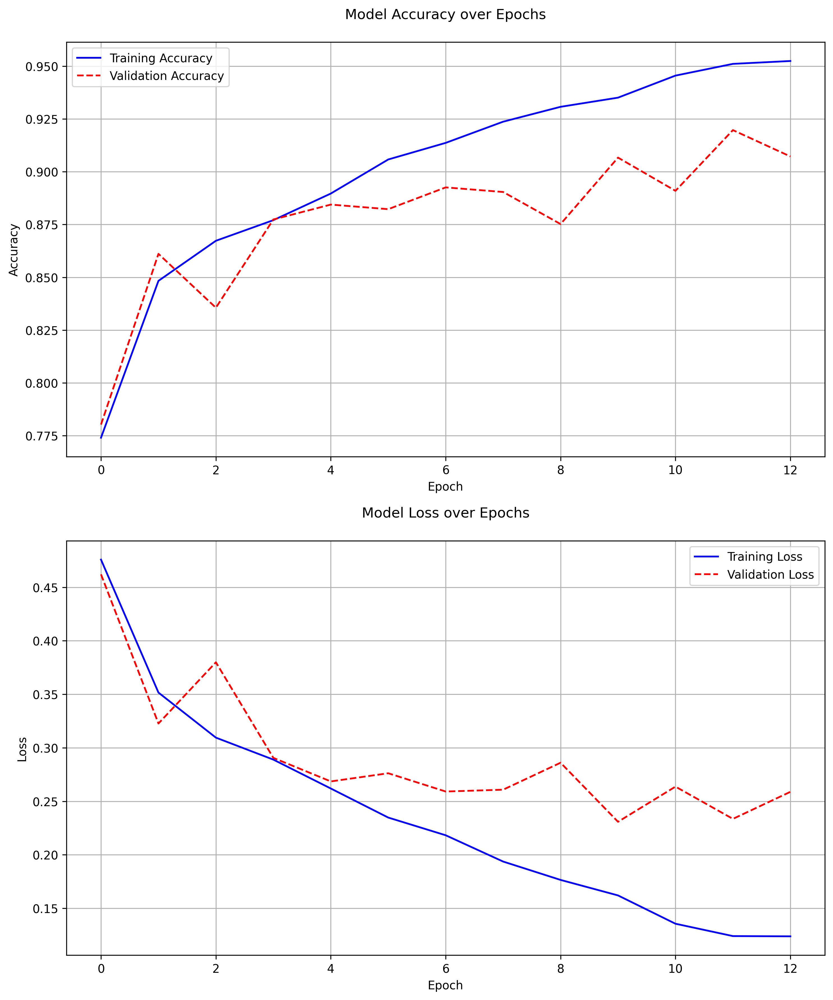

# Eye-Based Gender Classification Model

## Overview
This deep learning project implements an automated gender classification system based on eye morphometry. The model analyzes eye images to predict the subject's gender, contributing to the field of facial anthropometrics and analysis.

## Background
Facial anthropometrics can vary based on gender, age, ethnicity, and other factors. This project focuses specifically on gender determination through eye morphometry.

## Dataset
This model was trained on "Gender Determination with Morphometry of Eyes" dataset created by Gaurav Dutta, available on Kaggle at [Gender Determination with Morphometry of Eyes](https://www.kaggle.com/datasets/gauravduttakiit/gender-determination-with-morphometry-of-eyes).

**Dataset License**: CC BY 4.0 (https://creativecommons.org/licenses/by/4.0/)

## Technical Architecture

### Model Structure
The CNN architecture is optimized for eye feature extraction:
- **Input Layer**: 128x128x3 (RGB eye images)
- **Convolutional Layers**:
  - First Conv2D: 32 filters, 3x3 kernel, ReLU activation
  - Second Conv2D: 64 filters, 3x3 kernel, ReLU activation
- **Pooling Layers**: Max pooling with 2x2 windows
- **Dense Layers**:
  - Hidden layer: 128 units with ReLU activation
  - Output layer: Single unit with sigmoid activation for binary classification

### Training Parameters
- **Batch Size**: 32 images
- **Epochs**: 20 (maximum, with early stopping)
- **Optimizer**: Adam
- **Loss Function**: Binary Cross-entropy
- **Validation Split**: 20% of training data
- **Data Augmentation**:
  - Horizontal flipping
  - Image normalization (1/255 scaling)

## Setup and Installation

### Prerequisites
```pip install tensorflow numpy pillow```

### Directory Setup
1. Create a `train` directory
2. Inside `train`, create two subdirectories: `male` and `female`
3. Sort your eye images into respective gender directories

## Usage

### Training
```python train.py```

The script will:
- Load and preprocess the eye images
- Train the CNN model
- Save the best performing model
- Generate training metrics in a CSV file

### Prediction
```python predict.py```

Features:
- File picker dialog for image selection
- Gender prediction with confidence score
- Support for multiple image formats (jpg, jpeg, png, bmp, gif, tiff)
- Interactive batch processing with continue/exit prompt

## Model Performance

### Training History


## Model Performance Monitoring
- Best model weights are saved automatically
- Training metrics are logged to CSV
- Console output shows accuracy and loss metrics
- Early stopping prevents overfitting (patience=3)

## Limitations and Considerations
- Performance may vary based on image quality
- Results should be interpreted as experimental
- Model is intended as a research and learning tool

## Citation
Dataset: "Gender Determination with Morphometry of Eyes" by Gaurav Dutta
Available at: https://www.kaggle.com/datasets/gauravduttakiit/gender-determination-with-morphometry-of-eyes

## License
This project is licensed under the same terms as the dataset (CC BY 4.0)
